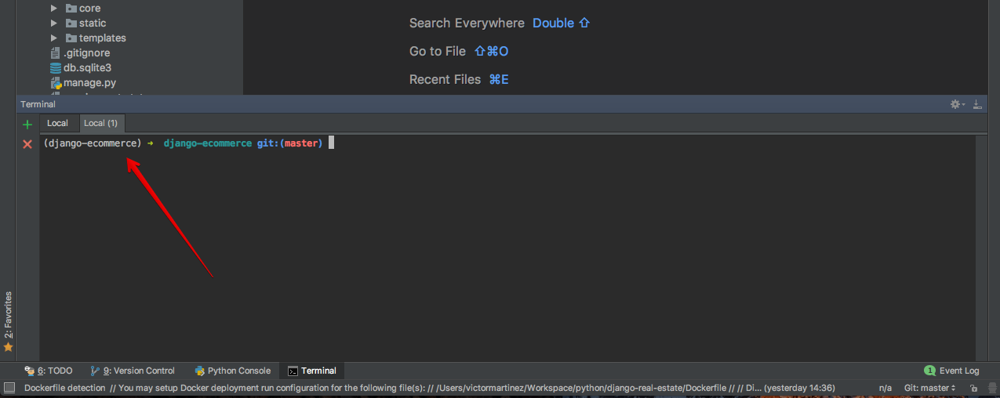
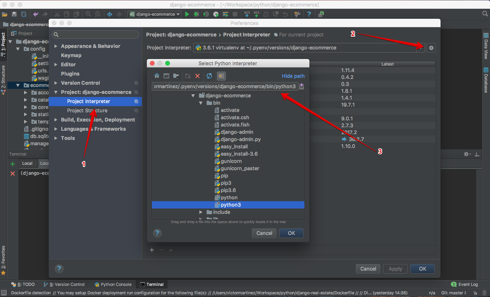

Pycharm é minha IDE favorita e sem dúvidas uma ferramenta poderosa. Ela te dá excelentes atalhos e um grupo de ferramentas que previnem o programador de ter que lidar com várias janelas. Uma delas é um terminal embutido que aumenta a sua produtividade uma vez que você não precisa mudar de contexto da IDE para o terminal e vice-versa.

Como você pode ver na imagem abaixo, o terminal dentro do Pycharm mostra o virtualenv atual que eu estou trabalhando.

Entretando, você pode acabar lidando com alguns erros no primeiro uso caso o seu ambiente local não esteja devidamente configurado. Como eu uso [Pyenv](https://github.com/pyenv/pyenv) para gerenciar minhas versões do Python e minhas _virtualenvs_, eu tive que configurar o ambiente para ter o terminal integrado com o Pycharm. É bem fácil:

1. Vá em `Preferences` > `Project Interpreter`
1. Clique na engrenagem e selecione **Add local**
1. Aponte para o arquivo python que fica dentro do seu virtualenv. Como eu esotu usando pyenv, o caminho é `~/.pyenv/versions/<virtualenv-name>/bin/python3`
1. Pode ser que você precise reiniciar o PyCharm.

##### Você não usa o Pyenv?

~~Instale-o e siga o tutorial~~. Você só precisa substituir o caminho pelo caminho do seu virtualenv.
