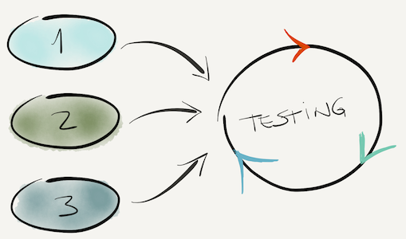

Uma conversa recente com um amigo trouxe à tona aspectos importantes do desenvolvimento de software. Algumas características como **feedback constante**, **ciclos curtos** e **aprendizado rápido** podem levar sua mente a pensar em frameworks Agile (por exemplo, Scrum, Kanban, Lean Software Development, etc). No entanto, eles não estão exclusivamente ligados a uma estrutura, mas a todo um conceito / ideia de abordar problemas por meio de períodos iterativos e incrementais que duram geralmente de 7 a 14 dias. Os benefícios são vistos claramente em equipes ágeis, mas nem todos os profissionais internalizaram esses conceitos no fluxo de trabalho pessoal. Se você fizer isso, provavelmente aumentará sua produtividade e se concentrará no produto final.

> Você é um programador Agilista?

Ao perguntar, eu quero que você pense sobre os conceitos e como você pode aplicá-los em seu fluxo de trabalho. Você trabalha com períodos curtos de tempo, feedback constante e aprendizado rápido? Pode parecer impossível a princípio ou não tão claro como aplicar isso, mas neste post tento trazer a provocação.

As perguntas abaixo revelam aspectos importantes do seu fluxo de trabalho. Vamos pensar sobre isso:

1. Como você lida com problemas? Você resolve de uma vez ou quebra em pedaços?
2. Você cria testes automatizados?
3. Você costuma criar um MVP simples ou tenta entregar a versão final de uma vez só?

Suas respostas provavelmente dizem algo que já sabemos: criar e manter um software não é uma tarefa fácil. Além das habilidades técnicas, é importante planejar a execução e proporcionar um processo de aprendizado rápido. Tenho tentado incorporar o fluxo de trabalho abaixo e espero que ele ajude você a entregar produtos de forma melhor e mais rápida.

## Planejamento

No momento em que você recebe uma tarefa para realizar, o primeiro impulso é começar a codificar e apenas parar quando tudo estiver funcionando corretamente. Isso acontece porque nós _imediatamente focamos em **como** (programação) em vez de **o que** (etapas)_ precisa ser feito. É uma abordagem muito arriscada porque você (i) provavelmente encontrará problemas não planejados que precisam ser resolvidos e / ou (ii) gastará mais tempo em coisas que não detectou anteriormente. O cenário ideal acontece quando conhecemos todos os passos meticulosos para fazer o trabalho com antecedência. Porém, muitas vezes temos apenas uma visão mais ampla do escopo.

Da próxima vez que você conseguir um recurso / bug / melhoria / tarefa para fazer, segure seu impulso por alguns minutos e desenhe as etapas que você deve seguir para conseguir isso. Durante o caminho você provavelmente notará que existem alguns casos extremos para ficar atento ou cenários que exigem um esforço extra.

É importante ressaltar que você não deve planejar tudo de uma vez (isso exigiria muito tempo / esforço). Apenas planeje a próxima versão do seu produto: comece com o mvp, depois v1, v2, v3 ...

_Dica:_ use um caderno / moleskine / papel para anotar todas as informações - ele limpa sua mente ao deixá-la livre para se concentrar na fase de execução.

## Dividir para conquistar

Cada problema pode ser dividido em pequenos pedaços e deve ser resolvido uma vez por vez. Tentar codificar tudo de uma vez irá distraí-lo para o que importa: fazer funcionar. Comece com componentes simples que funcionam no melhor cenário. Vamos ver um exemplo:

Imagine que você tenha que interagir com o serviço Elasticsearch para indexar documentos e recuperá-los. Portanto, é possível modelar o problema como:

_Interagindo com Elasticsearch_

1. Crie um cliente mínimo funcional (ou configure um existente)
2. Crie uma função que indexe um documento
3. Crie uma função que recupere um documento por id
   ...

Se você se concentrar em lidar com cada peça de uma vez, sua mente estará 100% concentrada em resolver isso, em vez de se preocupar constantemente com o quadro geral.

## Testes automatizados

Cada componente deve ser testado para garantir, pelo menos, os requisitos mínimos. Não vou entrar na discussão sobre TDD ou não-TDD. O resultado final é: você deve garantir que seus componentes funcionem corretamente.

## Ciclos curtos, melhoria constante

Você planejou as etapas, dividiu o problema em partes, começou a resolver um de cada vez e escreveu alguns testes automatizados. Lembre-se, todas as etapas devem se concentrar nos requisitos mínimos para alcançar o MVP, v1, v2, v3 e assim por diante. Dessa forma, você pode iterar ao longo de todo o ciclo, aprender as lições, desenvolver, testar e entregar rapidamente um software funcional. Se você gastar muito tempo planejando ou apenas desenvolvendo, provavelmente perderá a noção do Time-to-Market que muitas empresas lutam para serem boas.

E quanto a você? O que você usa para melhorar seu fluxo de trabalho?
