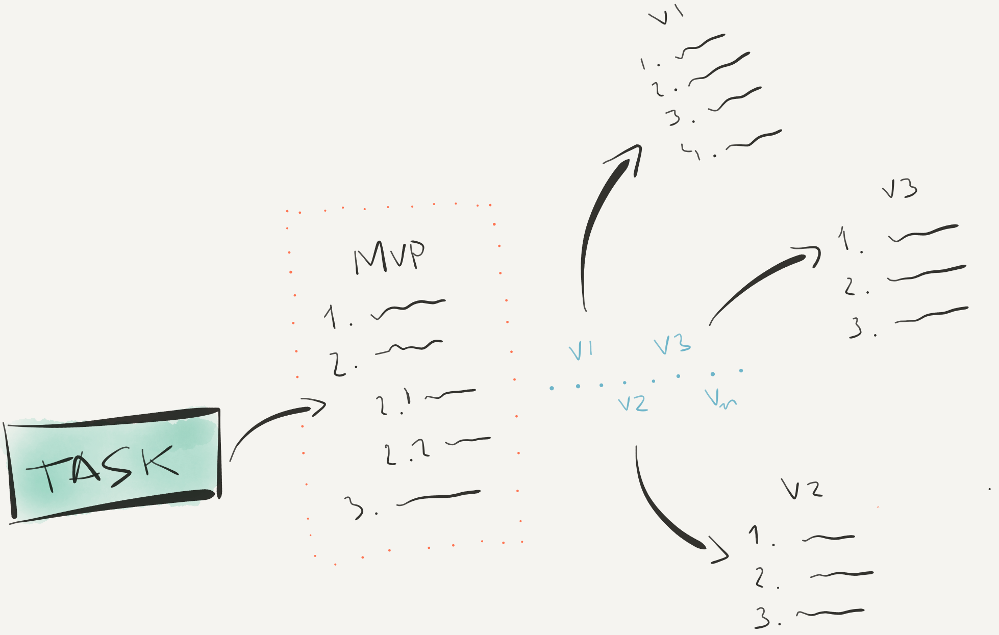

A recent conversation with a friend brought up important aspects of software development. Some characteristics like **constant feedback**, **short cycles** and **fast learning** might drive your mind to think about Agile frameworks (e.g. Scrum, Kanban, Lean Software Development, etc). However, they are not exclusively attached to one framework but a whole concept/idea of addressing problems through iterative and incremental periods lasting usually from 7 to 14 days. The benefits are clearly seen in agile teams but not all professionals have internalized those concepts into the personal workflow. If you do that it is likely to increase your productivity and focus on the deliverable.

> Are you an Agilist Programmer?

By asking that I want you to think about the concepts and how you can apply that into your workflow. Do you work with shor periods of time, constant feedback and fast learning? It might seem impossible at first or not so clear how to apply that but in this post I try to bring up the tease.

The questions below reveal important aspects of your workflow. Let's think over it by answering them:

1. How do you tackle problems? Do you solve at once or break into pieces?
2. Do you create automated tests?
3. Are you used to create a simple MVP or you try to deliver the final version once and for all?

Your answers probably tell you something we already know: creating and maintaining a software is not an easy task. Besides technical skills it is important to plan the execution and provide a fast-learning process. I have been trying to incorporate the workflow below and I hope it helps you to deliver faster and better products.

## Planning

By the time you are assigned a task to accomplish the first impulse is to start coding and only stop when everything is working properly. It happens because we _immediately focus on **how** (programming) instead of **what** (steps)_ need to be done. It is a very risky approach because you (i) will likely find unplanned issues that need to be addresses and/or (ii) will spend more time on things that you have not previously detected. The ideal scenario happens when we know all the meticulous steps to get the job done beforehand. However, many times we have just a broader view of the scope.

Next time you get a feature/bug/improvement/task to do hold your impulse for some minutes and outline the steps you must follow to accomplish that. During the path you probably you probably will notice there exist some corner cases to be attentive or scenarios that demand an extra effort.

It is important to highlight that you should not plan everything at once (that would take too much time/effort). Just plan the next version of your deliverable: start with the mvp, then v1, v2, v3...

_Hint:_ use a personal notebook/moleskine/paper to write down all the info - it clears your mind by making it free to focus on the execution phase.

## Divide to Conquer

Every single problem can be broken down into small pieces and must be tackled once at a time. Trying to code everything at once will distract you to what matters: make it work. Start with simple components that work in the best scenario. Let's see an example:

Imagine you have to interact with Elasticsearch service in order to index documents and retrieve them. So, it is possible to model the issue as:

_Interacting with Elasticsearch_

1. Create a minimum working client (or setup an existing one)
2. Create a function that index a document
3. Create a function that retrieve a document by id
   ...

If you focus on tackling each piece at a time your mind will be 100% concentrated into solving that instead of constantly worring about the big picture.

## Automated Tests

Each component must be tested to ensure, at least, the minimum requirements. I will not get into the discussion about TDD or not-TDD. The bottom line is: you must ensure your components work properly.

## Short cycles, constant improvement

You have planned the steps, divided the problem into pieces, started to solve one at a time and wrote some automated tests. Remember, all the steps must focus on the minimum requirements to reach the MVP, v1, v2, v3 and so on. That way you can iterate over the whole cycle, learn the lessons, develop, test and quick deliver a working piece of software. If you spend too much time on planning or only developing you probably will lost track of the Time to Market that many companies want to be good at.

How about you? What do you use that improve your workflow?
