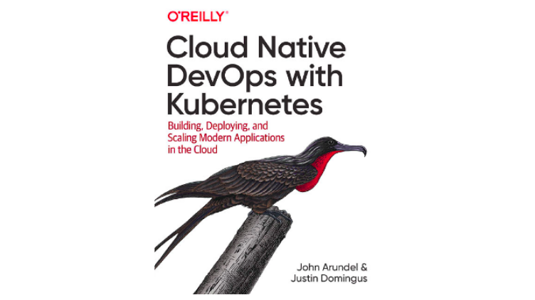

Particularmente, eu gosto do conteúdo produzido pela O'Reilly e [Cloud Native DevOps with Kubernetes](https://www.amazon.com.br/Cloud-Native-DevOps-Kubernetes-Applications-ebook/dp/B07PJ4HM92) não é uma exceção. Depois de tentar alguns livros e cursos eu encontrei um apanhado completo do Kubernetes no material escrito por John Arundel e Justin Domingus.

Os autores fizeram um trabalho maravilhoso com este livro cobrindo uma larga gama de tópicos. Ele começa com uma visão geral da Revolução Cloud seguido pelos primeiros passos com o Kubernetes. Então, à medida que você lê, o livro alcança amplos tópicos como Gerenciamento do Cluster e de Recursos, Ciclo de Vida dos Pods, ConfigMaps e Secrets, Segurança e Backups, Helm, Deployment Contínuo, Observabilidade, Monitoramento, Métricas, RBAC, etc.

Além dos tópicos mencionados acima, o livro preocupa-se com três aspectos: (i) as melhores práticas; (ii) a arquitetura interna da plataforma; (iii) ferramentas. Qualquer que seja seu nível de especialidade, definitivamente existe alguma coisa útil para aprender. É por isso que você deveria dar uma olhada no livro ainda que você se considere um profissional avançado no assunto. Todavia, se você tem conhecimentos avançados em Kubernetes pode ser que você queira checar outras fontes relacionadas aos tópicos específicos do seu interesse ou apenas fazer uma leitura dinâmica para os assuntos que você não está tão confortável.

Você pode estar se perguntando se este é um livro teórico ou prático. Os autores tentaram balacear ao prover exemplos práticos que você pode seguir. Entretanto, eu entendo que não é possível fornecer exercícios práticos para todos os tópicos e nem mesmo é o objetivo do livro. Portanto, é importante que o leitor "se vire" quando for o caso.
