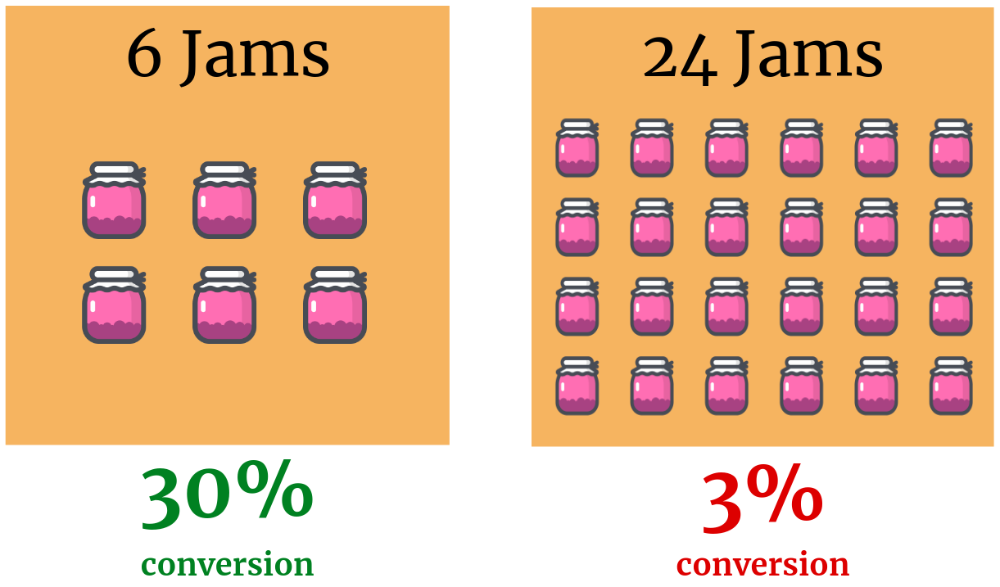

Tenho estudado Sistemas de Recomendação (RecSys) nos últimos meses. Muitos tópicos estão espalhados pela Internet e pensei em condensar os principais conceitos em uma série de postagens de blog. Para vocês interessados ​​no assunto, organizei o conteúdo e dividi em partes:

- Parte I: Introdução e níveis de personalização
- [Parte II: Como funciona](pt/blog/2019/2019-09-07-Getting_Started_with_Recommender_Systems_Part_II/)
- Parte III: Técnicas
- Parte IV: Métricas
- Parte V: Desafios
- Parte VI: Referências e leituras adicionais

## Introdução

RecSys é um tema de interesse de grandes empresas como Amazon, Spotify, Netflix, Github e Linkedin. Mike McGuire neste [post](https://www.huffpostbrasil.com/2013/08/01/netflix-profiles_n_3685876.html) explica que as empresas perceberam que "if there's not something else there surfacing that meets your interest beyond what you initially dialed in for, then you're out". Em outras palavras, as empresas se preocupam em fornecer não apenas o que o usuário procura, mas outros itens que atendam às suas preferências. Na Amazon, por exemplo, se você quiser comprar um Kindle o site o levará ao produto, mas também mostrará itens relacionados que você pode querer, como um carregador e uma capa à prova d'água.

Um artigo interessante de Standford, [When Choice is Demotivating: Can One Desire Much of a Good Thing?](Https://www.researchgate.net/publication/12189991_When_Choice_is_Demotivating_Can_One_Desire_Too_Much_of_a_Good_Thing), mostra o impacto negativo de apresentar muitas opções aos clientes.

Na verdade, quando não há personalização seus clientes acabam fazendo ["navegação infinita"](https://www.youtube.com/watch?v=VqdQZCvpIyo) (_infinite browsing_) e não há conversão e, consequentemente, um alto nível de churn. Este [artigo](https://www.businessinsider.com/netflix-recommendation-engine-worth-1-billion-per-year-2016-6) do Business Insider explica como "o efeito combinado da personalização e das recomendações economiza mais de \$ 1B por ano da Netflix".

RecSys são valiosos em [aumentar as vendas](http://fortune.com/2012/07/30/amazons-recommendation-secret/). Em 2012, a Amazon relatou "um aumento nas vendas de 29% para US$ 12,83 bilhões durante seu segundo trimestre fiscal, ante US$ 9,9 bilhões durante o mesmo período do ano passado". No entanto, eles não se limitam ao lucro. [Este infográfico](https://sigmoidal.io/recommender-systems-recommendation-engine/) ilustra que esses sistemas também **melhoram a retenção**, **formam hábitos** e **aceleram o trabalho**.

### Definição formal

Até agora vimos o RecSys como uma ideia geral que mistura alguns tópicos como `personalização`,` itens`, `recomendação` e` preferências do usuário`. Mas, **como podemos definí-lo?**

> Recommender Systems are software tools and techniques that provide suggestions for items that are most likely of interest to a particular user.
>
> \- F. Ricci, L. Rokach, B. Shapira, and P. B. Kantor, editors. Recommender Systems Handbook. Springera, 2011

Em tradução livre, Sistemas de Recomendação são ferramentas e técnicas de software que fornecem sugestões para itens que provavelmente são do interesse de um usuário específico.

## Níveis de Personalização

No contexto do RecSys, personalização significa o quanto seu algoritmo entende cada usuário para fornecer uma recomendação significativa. Basicamente, a abordagem pode ser entendida como **não personalizada** ou **personalizada**.

### Não personalizado

RecSys não personalizado não leva em consideração preferências individuais. Eles geralmente consideram um cálculo heurístico ou estatístico para recomendar itens. O cenário mais comum são os sites de Notícias como CNN, Bloomber, Globo.com, etc, em que há seções como "Notícias de última hora" ou "Em destaque". No Spotify, "Melhores músicas do Brasil". Amazon, "Livros mais vendidos".

Alguns exemplos:

1. Músicas mais ouvidas
2. Postagens de blog mais lidas
3. Artigos de notícias de última hora
4. Principais faixas do rádio
5. Livros mais vendidos
6. Hotéis com pontuação elevada
7. Melhores lugares para ficar

A vantagem dessa abordagem é que ela não é tão cara e é útil quando você não tem informações suficientes sobre os usuários. Dessa forma, você pode resolver **problemas de partida a frio** (explicados na Parte IV) e começar a fazer recomendações sem muito esforço.

### Personalizado

A abordagem personalizada considera as preferências do usuário para recomendar um item. Os algoritmos nesta categoria dependem de um pipeline que (i) obtém os dados do usuário; (ii) faz processamento para encontrar padrões nas preferências; (iii) calcula previsões. _Disclaimer: na Parte II e III esses conceitos ficarão mais claros._

O exemplo mais comum é a Netflix. Com base nos títulos de que você gostou, a Netflix processa e recomenda novos filmes ou séries.

A vantagem desta abordagem é o nível de personalização que você pode alcançar e, assim, aumentar a conversão em seu sistema. No entanto, é preciso muito mais esforço do que o anterior e, é claro, requer uma solução / algoritmo / arquitetura mais complexa.

### Notas

Não há bala de prata. A melhor abordagem é aquela que funciona para o seu negócio. É bastante comum adotar ambas as abordagens na mesma plataforma / site / sistema. Por exemplo, o Spotify fornece essas "Listas principais", mas também faz uma abordagem personalizada ao recomendar uma música semelhante à que você está ouvindo.

Uma regra de ouro é pensar em toda a experiência e no que você deseja alcançar: mais vendas; aumento de retenção; formar um hábito; Depois de definir seu objetivo, as métricas, algoritmos e decisões técnicas estarão relacionadas. Abordagens mistas são muito comuns.
