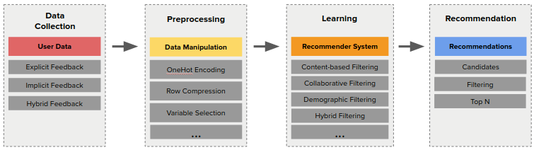
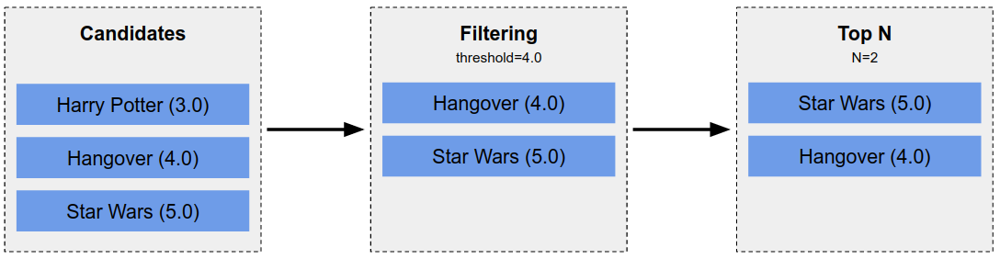

No post [anterior](/pt/blog/2019/2019-08-13-Iniciando_com_sistemas_de_recomendacao_parte_I/) eu introduzi a área de RecSys e os níveis de personalização. Hoje eu vou discutir sobre o pipeline de recomendação e como ele funciona.

Se você perdeu os outros posts, encontre aqui:

- [Parte I: Introdução e níveis de personalização](/pt/blog/2019/2019-08-13-Iniciando_com_sistemas_de_recomendacao_parte_I/)
- Parte II: Como funciona
- Parte III: Técnicas
- Parte IV: Métricas
- Parte V: Desafios
- Parte VI: Referências e leituras adicionais

## Como funciona

Há muito trabalho a ser feito antes de fazer a recomendação em si. A coleta de dados, o pré-processamento e o design do modelo, por exemplo, são fases importantes. De modo geral, é possível visualizar o processo como um pipeline composto pelas fases ilustradas na figura a seguir.

Nas próximas seções, mergulharemos em cada fase.

### Coleta dos Dados

O aspecto mais importante do RecSys é a compreensão das preferências dos usuários. Portanto, tudo começa com os dados coletados resultantes da interação entre usuários e itens. Dependendo dos dados coletados, você terá feedbacks **implícitos** ou **explícitos** sobre as preferências de seus usuários.

**1. Explícito:**

O usuário indica explicitamente o quanto gosta / não gosta de um produto. Por exemplo, classificações que variam de 1 a 5 (por exemplo, Amazon) ou gosto / não gosto (por exemplo, Facebook, Netflix).

Trabalhar com dados explícitos facilita o processo de compreensão das preferências dos usuários, mas traz alguns desafios: (i) uma vez que classificar itens exige esforço do usuário, nem todos os usuários classificam os itens consumidos; (ii) as pessoas avaliam os itens de maneira diferente devido a diferentes fatores (algumas pessoas são mais exigentes do que outras); (iii) existem pessoas tendenciosas em relação a itens / categorias / produtos específicos.

**2. Implícito:**

Feedback implícito, como o nome sugere, não explicita preferências com avaliações. Em vez disso, representa ações ou características que indicam o quanto um determinado usuário gosta de um determinado produto. Por exemplo, você pode não gostar de um vídeo no Youtube, mas assisti-lo do início ao fim. Apesar de não ter gostado do vídeo (feedback explícito), você assistiu a todo o vídeo (feedback implícito) e, portanto, é muito provável que tenha gostado.

Outros exemplos que são considerados feedback implícito:

&nbsp;&nbsp;&nbsp;&nbsp;&nbsp; i. Coloque os itens no carrinho de compras
&nbsp;&nbsp;&nbsp;&nbsp;&nbsp; ii. Número de vezes que você pesquisou por um item
&nbsp;&nbsp;&nbsp;&nbsp;&nbsp; iii. Quanto tempo você passou lendo um artigo

** 3. Híbrido:**

Existem abordagens que levam ambos os feedbacks em consideração para fornecer recomendações mais precisas. Uma vez que eles usam feedback explícito e implícito, diz-se que o algoritmo usa feedback híbrido. Certamente é uma abordagem mais poderosa porque no mundo real os usuários não gostam / não gostam explicitamente de todos os itens (o exemplo do Youtube mencionado acima ilustra o cenário).

** Discussão: usar ou não feedbacks híbridos? **
Não usar feedback híbrido não implica em um mecanismo RecSys ruim porque cada domínio de negócios requer abordagens específicas. A melhor maneira de desenvolver um bom motor é começar devagar e continuar iterando até atingir resultados satisfatórios e um custo de manutenção razoável. Às vezes, uma arquitetura muito complexa não compensa e, portanto, uma abordagem simples, mas robusta, faz um trabalho maravilhoso.

### Pré-processando

O pré-processamento é tão importante quanto a fase de coleta. No cenário do mundo real, você não pode ajustar os dados brutos diretamente nos algoritmos sem análise e pré-processamento. Elementos ruidosos e formato de dados são problemas comuns que precisam ser resolvidos. Outras questões podem requerer atenção especial:

&nbsp;&nbsp;&nbsp;&nbsp;&nbsp; i. Como transformar dados implícitos em números viáveis ​​para o seu modelo?
&nbsp;&nbsp;&nbsp;&nbsp;&nbsp; ii. Existe algum recurso que não contribui para o modelo?
&nbsp;&nbsp;&nbsp;&nbsp;&nbsp; iii. Como você vai estruturar os dados antes de treinar os modelos? (csv? baldes? arquivos? memória?)
&nbsp;&nbsp;&nbsp;&nbsp;&nbsp; iv. Como você vai fazer a ingestão de dados por meio do seu modelo?

Se você seguir alguns tutoriais na Internet, pode não perceber a etapa de pré-processamento e isso porque eles costumam usar conjuntos de dados gratuitos como [Movielens] (https://grouplens.org/datasets/movielens/). Nesses casos, os dados já foram pré-processados ​​em um padrão comum (_por exemplo, CSV, TSV, SSV, etc) como `user_id; item_id; rating; timestamp` e você precisa se preocupar com isso. No entanto, em cenários do mundo real, o pré-processamento é uma etapa comum em direção a um mecanismo RecSys melhor. A figura na seção \_Como funciona_ lista algumas técnicas como _OneHot Encoding_, _Row Compression_ e _Variable Selection_ que são muito comuns no campo Machine Learning, mas você pode não usar (todas).

### Aprendendo

Os motores RecSys geralmente aproveitam os algoritmos de aprendizado de máquina para construir seus modelos. A recomendação personalizada requer a construção da Matriz de Avaliações (R): uma matriz que representa as preferências do usuário. A tabela abaixo ilustra isso usando filmes como itens.

|        | Batman | Avengers | Harry Potter | Star Wars | Hangover | A Star is Born | Nemo | ... |
| ------ | ------ | -------- | ------------ | --------- | -------- | -------------- | ---- | --- |
| Victor | 4.0    | 4.0      |              |           |          | 2.0            | 2.0  |     |
| Jess   | 2.5    |          | 4.0          |           | 4.0      | 5.0            | 4.0  |     |
| Luke   | 4.0    |          | 3.0          | 3.0       |          | 1.0            |      |     |
| ...    |        |          |              |           |          |                |      |     |

Como você pode ver, a matriz tem algumas propriedades:

&nbsp;&nbsp;&nbsp;&nbsp;&nbsp; i. É esparso: os usuários não viam / assistiam / liam todo o catálogo de itens, certo?
&nbsp;&nbsp;&nbsp;&nbsp;&nbsp; ii. As linhas representam os usuários e as colunas representam os itens
&nbsp;&nbsp;&nbsp;&nbsp;&nbsp; iii. Valores ausentes indicam que o usuário não avaliou o item

Então, por meio de iterações matemáticas, ele prevê as classificações que os usuários dariam para cada item não visto e constrói a Matriz de classificações previstas (R ^):

|        | Batman | Avengers | Harry Potter | Star Wars | Hangover | A Star is Born | Nemo  | ... |
| ------ | ------ | -------- | ------------ | --------- | -------- | -------------- | ----- | --- |
| Victor | 4.0    | 4.0      | [3.0]        | [5.0]     | [4.0]    | 2.0            | 2.0   |     |
| Jess   | 2.5    | [2.0]    | 4.0          | [2.0]     | 4.0      | 5.0            | 4.0   |     |
| Luke   | 4.0    | [4.0]    | 3.0          | 3.0       | [4.0]    | 1.0            | [2.0] |     |
| ...    |        |          |              |           |          |                |       |     |

\* _Valores entre colchetes significam a classificação prevista._

Existem muitos algoritmos para obter a matriz acima e cada um tem suas idiossincrasias. Falaremos sobre eles na próxima postagem do blog (_prenda a respiração!_).

### Recomendação

Finalmente, é hora de recomendar um novo item aos seus usuários. Assim que tivermos a Matriz de classificações previstas (R ^), fazer a recomendação é uma questão de selecionar e filtrar os itens previstos da seguinte forma:

&nbsp; &nbsp; &nbsp; &nbsp; &nbsp; **1. Selecione os candidatos:** Selecione os itens cujas avaliações foram previstas.
&nbsp; &nbsp; &nbsp; &nbsp; &nbsp; **2. Filtragem:** Defina um limite (por exemplo, 4,0) e exclua candidatos cujas classificações sejam inferiores a isso.
&nbsp; &nbsp; &nbsp; &nbsp; &nbsp; **3. Top N:** Classifica o resultado por classificação, estabelece o número de recomendações (N) e apresenta ao usuário.

A figura abaixo ilustra o processo levando em consideração o usuário Victor listado na tabela anterior.

## Predição vs Recomendação

Você pode ler postagens que usam **previsão** e **recomendação** de forma intercambiável, mas têm significados diferentes. **Previsão** corresponde à classificação esperada para um determinado item. Na fase de aprendizagem, seu modelo atribui classificações aos itens que o usuário não viu e essas classificações são previsões. Por outro lado, **recomendação** corresponde ao próprio item (ou conjunto de itens) que está sendo recomendado ao usuário.
