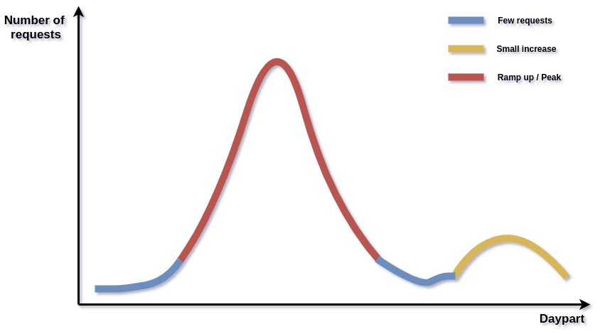
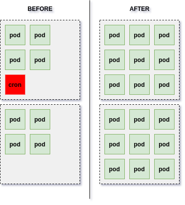

Existem empresas que dependem fortemente de períodos específicos do dia para obter lucro. Empresas de _food service_, por exemplo, tendem a ter uma operação aquecida ao meio-dia e o comportamento oposto nos demais períodos do dia. Em relação à infraestrutura, o fenômeno é particularmente interessante porque em um determinado período do dia a aplicação recebe uma quantidade impressionante de solicitações e o cluster deve ser capaz de escalar muito rápido. Uma escala lenta traria erros e lentidão para o cliente e, então, resultaria em aumento do churn. O gráfico abaixo exemplifica o cenário.



Você pode se perguntar se o problema pode ser resolvido com um mecanismo simples de escalonamento automático. Bem, isso funciona para ~95% dos clientes, mas ~5% terão problemas. A velocidade de expansão da infraestrutura pode não ser rápida o suficiente para lidar com a avalanche de solicitações. Felizmente, uma boa solução (até agora) é dimensionar as máquinas de antemão. Se você tiver um cluster Kubernetes, a solução é mais fácil do que você pensa: uma combinação de escalonamento automático horizontal de pod e CronJobs resolve o problema.

Um agradecimento especial a [Robson Peixoto](https://www.linkedin.com/in/robsonpeixoto/) por me guiar nessa tarefa.

## Visao geral

A ideia é criar um CronJob com as permissões corretas para editar as propriedades de escalonamento automático e, portanto, aumentar ou diminuir o número de pods disponíveis. A imagem abaixo ilustra o cenário.



Embora a imagem ilustre um processo de aumento de pods, o oposto também pode ser realizado: você pode querer diminuir o número de pods durante a madrugada, por exemplo, para diminuir o número de nós e, portanto, o custo de infraestrutura.

## Horizontal Pod Autoscaler

Como o CronJob vai **editar** as propriedades de escalonamento automático, precisamos de um Horizontal Pod Autoscaler disponível. O código yaml abaixo ilustra o escalonamento de uma aplicação back-end localizada dentro do namespace `backend`.

```yaml
kind: HorizontalPodAutoscaler
apiVersion: autoscaling/v2beta1
metadata:
  name: backend-autoscale
  namespace: backend
spec:
  scaleTargetRef:
    apiVersion: apps/v1
    kind: Deployment
    name: backend-web
  minReplicas: 30
  maxReplicas: 50
  metrics:
    - type: Resource
      resource:
        name: cpu
        targetAverageValue: 120m
```

## Permissões

Agora é hora de configurar as permissões do CronJob. Para fazer isso, usamos o RBAC para conceder acesso à API Kubernetes e garantir que ele tenha apenas permissão para acessar o recurso de escalonamento automático. Eu uso o termo `cronscale` para identificar o processo de dimensionamento de acordo com o CronJob.

```yaml
apiVersion: v1
kind: ServiceAccount
metadata:
  name: backend-cronscale
  namespace: backend
---
apiVersion: rbac.authorization.k8s.io/v1
kind: ClusterRole
metadata:
  name: backend-cronscale
  namespace: backend
rules:
  - apiGroups: ["autoscaling"]
    resources: ["horizontalpodautoscalers"]
    verbs: ["get", "list", "patch"]
---
apiVersion: rbac.authorization.k8s.io/v1
kind: ClusterRoleBinding
metadata:
  name: backend-cronscale
  namespace: backend
roleRef:
  apiGroup: rbac.authorization.k8s.io
  kind: ClusterRole
  name: backend-cronscale
subjects:
  - kind: ServiceAccount
    name: backend-cronscale
    namespace: backend
```

## Aplicação

Antes de criar o CronJob, precisamos criar a imagem / aplicação responsável por atualizar as propriedades de escalonamento automático. Para isso, sugiro usar o [cliente python](https://github.com/kubernetes-client/python). O snippet de código abaixo é apenas um exemplo de implementação que você pode usar. Fique à vontade para mudar de acordo com suas necessidades.

```python
# settings.py

PROJECTS = {
    "backend": {
        "HPA": {
            "NAMESPACE": "backend",
            "NAME": "backend-autoscale",
            "TARGET": "backend-web",
        }
    }
}
```

Em vez de manter strings hardcoded no código, utilizo um arquivo `settings` para armazenar as propriedades relacionadas a cada projeto ...

```python
# hpa.py
from kubernetes import config

config.load_incluster_config()

from kubernetes import client
from kubernetes.client.models.v2beta1_horizontal_pod_autoscaler import (
    V2beta1HorizontalPodAutoscaler,
)

import settings


def scale(
    project_name: str, min_replicas: int, max_replicas: int
) -> V2beta1HorizontalPodAutoscaler:
    config = settings.PROJECTS[project_name]["HPA"]

    api_client = client.AutoscalingV2beta1Api(client.ApiClient())
    v2beta1_hpa = api_client.read_namespaced_horizontal_pod_autoscaler(
        config["NAME"], config["NAMESPACE"]
    )
    v2beta1_hpa.spec.min_replicas = min_replicas
    v2beta1_hpa.spec.max_replicas = max_replicas
    v2beta1_hpa.status = None

    return api_client.patch_namespaced_horizontal_pod_autoscaler(
        config["NAME"], config["NAMESPACE"], v2beta1_hpa
    )
```

... então eu posso passar como parâmetro o nome do projeto (`backend`) para a função `scale` e ela saberá onde obter as propriedades.

## CronJob

Agora que temos as permissões, é hora de criar o CronJob. Preste atenção à 12ª linha, pois ela permite que o kubernetes execute o pod com as permissões que configuramos anteriormente.

```yaml
apiVersion: batch/v9beta1
kind: CronJob
metadata:
  name: cronscale-midday
  namespace: backend
spec:
  schedule: "<YOUR-CRON-GOES-HERE>" # UTC
  jobTemplate:
    spec:
      template:
        spec:
          serviceAccountName: backend-cronscale
          restartPolicy: Never
          containers:
            - name: job
              image: <YOUR-IMAGE-AND-VERSION-GOES-HERE>
              imagePullPolicy: IfNotPresent
              command: [<YOUR-COMMAND-GOES-HERE>]
```

## Considerações Importantes

It is important to be carefull regarding some points:

1. **UTC vs LocalTime:** Configure the Dockerfile to use UTC time and consider it in the `schedule` property.

2. **Click:** You can wrap the python code with [Click](https://click.palletsprojects.com/en/7.x/) to create an easy to use command line interface.

3. **Configmaps:** The settings module use hardcoded values but it could easily take the values from a ConfigMap.

4. **Non-root user:** Do not use root user for the Dockerfile. You can take the Dockerfile below as a starting point:

É importante ter cuidado com alguns pontos:

1. **UTC vs LocalTime:** Configure o Dockerfile para usar o horário UTC e considere-o na propriedade `schedule`.

2. **Click:** Você pode usar o [Click](https://click.palletsprojects.com/en/7.x/) para criar uma CLI fácil de usar.

3. **Configmaps** O arquivo _settings_ usa valores fixos (hardcoded), mas pode utilizar Configmaps se não gostar da abordagem.

4. **Usuário não root:** Não use usuário root para o Dockerfile. Você pode usar o Dockerfile abaixo como ponto de partida:

```dockerfile
FROM python:3.7

ENV PYTHONUNBUFFERED=1

ENV TZ=UTC

RUN useradd -ms /bin/bash app

USER app

WORKDIR /home/app

ADD . /home/app

RUN pip install --upgrade pip && pip install -r requirements.txt
```
