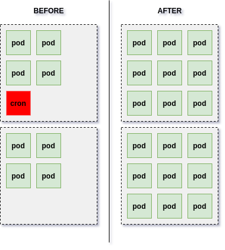

There are businesses that heavily rely on specific periods of day to make profit. Food ordering companies, for example, tend to have a heated operation during midday and the opposite behavior in other dayparts. Regarding the infrastructure, the phenomenon is particularly interesting because in a specific period of day the application receives an impressive amount of requests and the cluster must be able to scale really fast. A slow scale would bring errors and slowness to customer and, then, result into churn increase. The chart below exemplifies the scenario.


You might wonder whether the problem can be solved with a simple autoscaling mechanism. Well, that works for ~95% of the customers but ~5% will have issues. The velocity of scaling up the infrastructure might not be fast enought to address the avalanche of requests. Luckily, a nice solution (so far) is to scale the machines beforehand. If you have a Kubernetes cluster the solution is easier than you think: a combination of Horizontal Pod Autoscaling and CronJobs does the trick.

A special thanks to [Robson Peixoto](https://www.linkedin.com/in/robsonpeixoto/) for providing me guidance to accomplish the task.

## General Overview

The idea is to create a CronJob with the right permissions to edit autoscaling properties and, therefore, increase or decrese the number of pods available. The image below illustrates the scenario.



While image illustrates a scaling up process, the opposite could also be accomplished: you might want to decrease the number of pods during the dawn, for example, to diminish the number of nodes and, therefore, the cost.

## Horizontal Pod Autoscaler

Since the CronJob is going to **edit** the autoscaling properties we need a basic Horizontal Pod Autoscaler available. The yaml code below illustrates the scaling of a backend application located inside the namespace `backend`.

```yaml
kind: HorizontalPodAutoscaler
apiVersion: autoscaling/v2beta1
metadata:
  name: backend-autoscale
  namespace: backend
spec:
  scaleTargetRef:
    apiVersion: apps/v1
    kind: Deployment
    name: backend-web
  minReplicas: 30
  maxReplicas: 50
  metrics:
    - type: Resource
      resource:
        name: cpu
        targetAverageValue: 120m
```

## Permissions

Now, it is time to configure CronJob permissions. To do so, we use the RBAC to grant access to Kubernetes API and make sure it has only permission to access the autoscaling resource. I use the term `cronscale` to identify the process of scaling according to the CronJob.

```yaml
apiVersion: v1
kind: ServiceAccount
metadata:
  name: backend-cronscale
  namespace: backend
---
apiVersion: rbac.authorization.k8s.io/v1
kind: ClusterRole
metadata:
  name: backend-cronscale
  namespace: backend
rules:
  - apiGroups: ["autoscaling"]
    resources: ["horizontalpodautoscalers"]
    verbs: ["get", "list", "patch"]
---
apiVersion: rbac.authorization.k8s.io/v1
kind: ClusterRoleBinding
metadata:
  name: backend-cronscale
  namespace: backend
roleRef:
  apiGroup: rbac.authorization.k8s.io
  kind: ClusterRole
  name: backend-cronscale
subjects:
  - kind: ServiceAccount
    name: backend-cronscale
    namespace: backend
```

## Application

Before creating the CronJob, we need to create the image/application responsible for updating the autoscaling properties. For that, I suggest using the [python client](https://github.com/kubernetes-client/python). The code snippet below is just an example of implementation that you can use. Feel free to change according to your necessities.

```python
# settings.py

PROJECTS = {
    "backend": {
        "HPA": {
            "NAMESPACE": "backend",
            "NAME": "backend-autoscale",
            "TARGET": "backend-web",
        }
    }
}
```

Instead of keeping string floating around the code, I use a settings module to store the properties related to each project...

```python
# hpa.py
from kubernetes import config

config.load_incluster_config()

from kubernetes import client
from kubernetes.client.models.v2beta1_horizontal_pod_autoscaler import (
    V2beta1HorizontalPodAutoscaler,
)

import settings


def scale(
    project_name: str, min_replicas: int, max_replicas: int
) -> V2beta1HorizontalPodAutoscaler:
    config = settings.PROJECTS[project_name]["HPA"]

    api_client = client.AutoscalingV2beta1Api(client.ApiClient())
    v2beta1_hpa = api_client.read_namespaced_horizontal_pod_autoscaler(
        config["NAME"], config["NAMESPACE"]
    )
    v2beta1_hpa.spec.min_replicas = min_replicas
    v2beta1_hpa.spec.max_replicas = max_replicas
    v2beta1_hpa.status = None

    return api_client.patch_namespaced_horizontal_pod_autoscaler(
        config["NAME"], config["NAMESPACE"], v2beta1_hpa
    )
```

... then I can pass the project name (`backend`) to the `scale` function and it knows where to get the properties.

## CronJob

Now that we have the permissions, it is time to create the CronJob. Pay attention to the 12th line because it allows kubernetes to run the pod with the permissions we have setup before.

```yaml
apiVersion: batch/v9beta1
kind: CronJob
metadata:
  name: cronscale-midday
  namespace: backend
spec:
  schedule: "<YOUR-CRON-GOES-HERE>" # UTC
  jobTemplate:
    spec:
      template:
        spec:
          serviceAccountName: backend-cronscale
          restartPolicy: Never
          containers:
            - name: job
              image: <YOUR-IMAGE-AND-VERSION-GOES-HERE>
              imagePullPolicy: IfNotPresent
              command: [<YOUR-COMMAND-GOES-HERE>]
```

## Important Considerations

It is important to be carefull regarding some points:

1. **UTC vs LocalTime:** Configure the Dockerfile to use UTC time and consider it in the `schedule` property.

2. **Click:** You can wrap the python code with [Click](https://click.palletsprojects.com/en/7.x/) to create an easy to use command line interface.

3. **Configmaps:** The settings module use hardcoded values but it could easily take the values from a ConfigMap.

4. **Non-root user:** Do not use root user for the Dockerfile. You can take the Dockerfile below as a starting point:

```dockerfile
FROM python:3.7

ENV PYTHONUNBUFFERED=1

ENV TZ=UTC

RUN useradd -ms /bin/bash app

USER app

WORKDIR /home/app

ADD . /home/app

RUN pip install --upgrade pip && pip install -r requirements.txt
```
