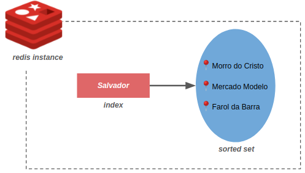

*TL;DR;* We are going to use Redis to store geolocated data.

Talking about Redis invariably makes us think about cache. However, it evolved and today it is considered a server that stores different data structures (hashes, sets, lists, etc).

In today's post we are going to stay out of common usage and understand how Redis helps us to work with geolocated data (for more information, check the [docs](https://redis.io/commands#geo)).


## Setting up environment
You need to set up an environment if you want to execute the commands. I'm using [docker](https://www.docker.com/) and [redis-cli](https://redis.io/topics/rediscli). The latter comes after installing Redis but I like to have it apart (check this [tutorial](https://codewithhugo.com/install-just-redis-cli-on-ubuntu-debian-jessie/)). Then, just execute the commands below:

```bash
$ docker run --name=my-redis --rm -p "6379:6379" redis:6 redis-server
$ redis-cli

127.0.0.1:6379> 
```

## Data structure
Storing anything in Redis requires usage of index. In a simple manner, it is a *string* that points to a data structure. To handle geolocated data Redis uses the structure *sorted set* in such way that each point (lat/long) is labeled by a **string**. The simplified image below illustrates the architecture:



In the example we have an index named *Salvador* (city I'm born and bred =)) that points to a set of points.

**Attention:** as redis uses sorted set it is not possible to store two points with the same label. The insertion of a point correspond to an update of coordinates (**upsert**).


## Getting the hands dirty
Redis gives us an API with the following commands: `GEOADD`,`GEODIST`, `GEOHASH`, `GEOPOS`, `GEOSEARCH`. Let's start by adding some points to the index `location:salvador`:

**Attention:** The commands will soon be deprecated: `GEOMEMBER`, `GEORADIUS`, `GEORADIUS_RO`, `GEORADIUSBYMEMBER`, `GEORADIUSBYMEMBER_RO`. Due to that we won't use them in this post.

```bash
127.0.0.1:6379> GEOADD location:salvador -38.5139209 -12.9730385 mercadomodelo -38.5329599 -13.0101531 faroldabarra -38.5260635 -13.0107505 morrodocristo
```

Two **important** observations:

1. Redis takes **first** the longitude.
    1. `CMD <set-name> <long> <lat> <member-name>`
2. We are going to handle points inside an index and, thus, I used the *lowercase* pattern for labels and index. That avoids some typos during the search and makes it legible enough (see *Redis keys* section in [docs](https://redis.io/topics/data-types-intro)).

Once we have the points inserted, we can play with the API. Let's dive into some use cases.


### Get longitude and latitude

```bash
127.0.0.1:6379> GEOPOS location:salvador faroldabarra

1) 1) "-38.53296071290969849"
   2) "-13.01015213126540715"
2) 1) "-38.52607816457748413"
   2) "-13.0107807421129209"
```

### Calc distance (in meters) between two points

```bash
127.0.0.1:6379> GEODIST location:salvador faroldabarra morrodocristo

"749.1386"
```

*OBS*: You can provide, at the end, the distance metric you want to use (m, km, ft, mi).

### Update a point

```bash
127.0.0.1:6379> GEOADD location:salvador -38 -12 elevadorlacerda

127.0.0.1:6379> GEOADD location:salvador -38.5159605 -12.9740495 elevadorlacerda

127.0.0.1:6379> GEOPOS location:salvador elevadorlacerda
```

*OBS:* Since we are working with a set, updating a point occurs by adding a new point with the same label.

### Search

```bash
# Points in a radius of 1600 meters from a specific coordinate
127.0.0.1:6379> GEOSEARCH location:salvador FROMLONLAT -38.5175291 -13.0060716 BYRADIUS 1600 m
1) "morrodocristo"

# Points in a radius of 200 km from an existing point
127.0.0.1:6379> GEOSEARCH location:salvador FROMMEMBER faroldabarra BYRADIUS 200 km
1) "faroldabarra"
2) "morrodocristo"
3) "elevadorlacerda"
4) "mercadomodelo"

# Same query above but retrieving coords and distance
127.0.0.1:6379> GEOSEARCH location:salvador FROMMEMBER faroldabarra BYRADIUS 200 km WITHCOORD WITHDIST
1) 1) "faroldabarra"
   2) "0.0000"
   3) 1) "-38.53296071290969849"
      2) "-13.01015213126540715"
2) 1) "morrodocristo"
   2) "0.7491"
   3) 1) "-38.52607816457748413"
      2) "-13.0107807421129209"
3) 1) "elevadorlacerda"
   2) "4.4180"
   3) 1) "-38.51596087217330933"
      2) "-12.97405009779294005"
4) 1) "mercadomodelo"
   2) "4.6149"
   3) 1) "-38.51392239332199097"
      2) "-12.97303874405036339"

```

**Obs:**

- `GEOSEARCH` allows to constraint the quantity of results by receiving the `COUNT` parameter.
- Replace `BYRADIUS 200 km` by `BYBOX 200 200 km` and Redis will consider a rectangle rather than a circular area.
- It's possible to retrieve values sorted by distance: add `ASC` or `DESC` to the end of the query.

### Store the search results

Redis allows you to search and store the result in a specific index of your choice. In the example belo we search in `location:salvador` and store the results into `location:results:salvador`.

```bash
127.0.0.1:6379> GEOSEARCHSTORE location:results:salvador location:salvador FROMMEMBER faroldabarra BYRADIUS 200 km

127.0.0.1:6379> KEYS *
1) "location:salvador"
2) "location:results:salvador"

127.0.0.1:6379> ZRANGE location:results:salvador 0 -1
1) "faroldabarra"
2) "morrodocristo"
3) "mercadomodelo"
```

### Geohash

Redis uses a Geohash (string comprised of 11 chars) to represent points in such way that it can be translated to a coord (lat / long).

```bash
127.0.0.1:6379> GEOHASH location:salvador morrodocristo faroldabarra
1) "7jstgr6nvs0"
2) "7jstgpt4kg0"
```

You can verify the transation geohash ↔ lat/long by the website *https://geohash.org/<coloque-aqui-o-geohash>*.

### *Sorted Set* operations

Since Redis stores the geoloc in the form of a sorted set, it it is possible to access the data using the API provided to handle sorted sets. Let's see some examples (all commands are available in the [docs](https://redis.io/commands#sorted-set)):


```bash
127.0.0.1:6379> ZRANGE location:salvador 0 -1
1) "faroldabarra"
2) "morrodocristo"
3) "elevadorlacerda"
4) "mercadomodelo"

127.0.0.1:6379> ZREM location:salvador elevadorlacerda
(integer) 1

127.0.0.1:6379> ZCARD location:salvador
(integer) 3

127.0.0.1:6379> ZCOUNT location:salvador -inf +inf
(integer) 3
```

## Final thoughts

- Think about Redis beyond the key-value store. There are other data structures for you to play with.
- Be careful naming index and the points. You will need to retrieve them in a intelligent way that avoids typos.
- Before inserting all the points take a time to consider how you will search the data. Does it make sense to store all points in a single index? What if you need to do *sharding*?


That's it. Did you like the post?
