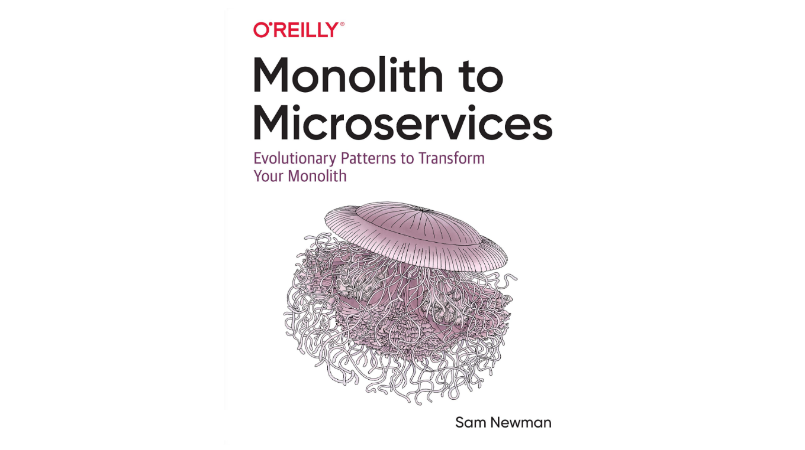

Microsserviços tem sido um tópico acalorado nos últimos anos e muitos desenvolvedores ~~imprudentes~~ desejam migrar seus monólitos legados para essa arquitetura. No entanto, o processo de quebrar os bancos de dados e o código-fonte exige cautela, compreensão do domínio e uma base técnica sólida para dar suporte à nova arquitetura. Monolith to Microservices, de Sam Newman, é essencial para entender os padrões que podem ajudá-lo na transição.

O autor inicia o livro com conceitos fundamentais como _information hiding_, design orientado a domínio (DDD), acoplamento, _delivery contention_, etc. Ele desempenha um papel importante, pois expõe aspectos que você deve compreender para modelar adequadamente uma arquitetura orientada a microsserviços.

Em seguida, o livro mergulha nos padrões de como dividir seu código e banco de dados. Apresenta muitos desafios que você provavelmente enfrentará e propõe soluções que você deve avaliar de acordo com sua realidade.

Finalmente, Sam Newman discute pontos comuns de dor ao crescer de alguns serviços para centenas. Ele cobre problemas técnicos (por exemplo, rastreabilidade e observabilidade) e aspectos não técnicos (por exemplo, _ownership_ e experiência do desenvolvedor).

Na minha opinião, Monolith to Microservices vale a pena ler porque traz soluções para problemas que você não conhece até enfrentar. Além disso, os desafios apresentados fazem você pensar sobre os requisitos para avançar em direção a uma nova arquitetura. É importante destacar que ele não defende uma arquitetura de microsserviço - nem diz que você deve manter seu monólito. Como você entende os fundamentos e tem maturidade suficiente para avaliar sua situação, isso mostra padrões para facilitar a transição.

Apesar de saber que um Monolito Modular ou uma arquitetura orientada a macroserviços serão apropriados para muitos casos, vale a pena conhecer os padrões para decompor bancos de dados e sistemas. Com os desafios em mãos, você pode criar sistemas mais fáceis de manter, evoluir e decompor.
