**É o Claude Code projetando e montando um _harness_ na hora**, sob medida para a tarefa que você pediu. Entenda o _harness_ como a estrutura que orquestra: qual agente, em que ordem, com qual contexto, com qual critério de parada. Com essa habilidade você não precisa mais desenhar a orquestração. Basta **reconhecer qual das seis formas** a máquina deve assumir e usar as palavras-chave certas no prompt que o modelo monta a estrutura de _harness_.

## Por que a feature existe: os três modos de falha da sessão única

Usar uma única janela de contexto não vai lhe fazer mal para atividades de tamanho pequeno a médio porte. Porém, quando falamos de tarefas longas e/ou complexas, que demandam muitos tokens de conversa, você fatalmente vai encontrar algum dos problemas abaixo:

| Falha | O que acontece | Padrão que endereça esse problema |
|---|---|---|
| **Agent laziness** | Você dá 15 tarefas, ele confirma as 15 e entrega 7. | Fan out (uma tarefa = um agente) |
| **Self-preference** | Você pede à sessão que audite o próprio trabalho. Ela é enviesada, como qualquer pessoa avaliando o próprio entregável. | Adversarial verification |
| **Goal drift** | O objetivo é nítido no início mas se dilui em auto-compactações, tool calls e sumarizações. | Loop until done + rubrica escrita antes |

### Agentic laziness

Erro em que a execução das tarefas começa forte e **desiste em silêncio** antes do fim da lista. Ao pedir um relatório final de execução o mesmo fala das 15, por exemplo, mas na entrega constam 7.

### Self preference

Quem executa, o autor, e quem revisa, o revisor, são **o mesmo nó/agente**. O ciclo se fecha dentro da própria janela de contexto e o veredito sai sempre igual. Não é desonestidade do modelo: é o viés que torna a avaliação impossível.

### Goal drift

A cada compactação o objetivo perde um pouco de contexto. O detalhe que fazia o modelo **entender** a tarefa — não só executá-la — cai numa sumarização e **não volta**.

## Resolvendo os problemas com o uso de Workflows

O workflow ataca os problemas pela mesma via: **ao invés vez de utilizar uma sessão longa, ele cria uma série de agentes com janelas de contexto individuais**, cada um resolvendo um pedaço isolado.

O ponto estrutural, que vale mais que os seis padrões somados: **o loop determinístico segura o estado.** A lista de 5.000 itens, o bracket do torneio, a ordem de execução — isso vive no código JavaScript do workflow, não na janela de contexto de ninguém. Só o que precisa ser *raciocinado* entra num contexto.

### Os seis padrões

As seis formas que o _harness_ pode assumir:

1. Classify and act
2. Fan out and synthesize
3. Adversarial verification
4. Generate and filter
5. Tournament
6. Loop until done

#### Classify and act

**O que é.** Um recepcionista na porta. Um agente classifica o input e roteia para o responsável. A classificação define o *caminho*.

**A ideia central é quarentena.** Você decide o que fazer com o input *antes* que ele chegue a um agente com poder de ação. Agente leitor → ticket → agente confiável que age.

**Quando usar.** Triagem de inbox, roteamento de tickets, qualquer fila heterogênea de entrada.

**Prompt:**
> Crie um workflow que faz uma triagem dos tickets dentro da pasta `<pasta>`por meio da criação de um agente classificador que lê cada arquivo e roteia para o respectivo handler bug / reembolso / lead / spam, mas que também faz a deduplicação em relação ao que já foi triado antes que o ticket chegue no handler.

**Dica:** dois detalhes que fazem a diferença: **deduplicação antes de agir** e **classificador separado do handler**.

#### Fan out and synthesize

**O que é.** Quebrar a tarefa em partes **mutuamente exclusivas**, um agente por parte, em paralelo e em contextos limpos, e depois um passo de *barrier synthesize* que espera todos terminarem e funde os resultados.

**Por que contextos limpos importam.** Os arquivos não se contaminam entre si. Cada agente vê só o seu pedaço.

**Quando usar.** Deep research (um agente por lente), due diligence (um agente por pasta), auditoria de código arquivo a arquivo.

**Dica:** exigir o *source path* em cada achado transforma o output em citações rastreáveis. É o que separa um relatório útil de um relatório auditável.

**Prompt:**
> Construa um workflow que faz uma due diligente nos dados existentes na pasta `<pasta>` por meio de um processo de fan out de forma que **um, e apenas um, agente atue por subdiretório, cada um com seu próprio contexto limpo para que arquivos não contaminem outros agentes**. Obrigue que cada agente retorne um resumo estruturado **com o caminho exato de cada achado**. Então execute um passo de sintetização que aguarda o término de todos e faz um merge dos resultados em um único arquivo localizado em `<arquivo>`, onde cada afirmação deve ter o link correspondente para o arquivo que a afirmação se relaciona.

#### Adversarial verification

**O que é.** O antídoto direto para o problema de _self-preference_. Ao invés de deixar o Claude Code achar que foi ótimo, você **obriga o ceticismo**: vários advogados do diabo conferem o output contra uma rubrica.

**Passo preparatório que muda tudo:** *escreva a rubrica antes de executar o workflow*. Ela vira o pseudo-plano contra o qual os céticos empurram. Sem rubrica, ceticismo é vago.

    Uma rubrica (_rubric_) é um conjunto de critérios claros,
    objetivos e estruturados usado para avaliar, pontuar ou
    auditar a qualidade de um código, tarefa ou plugin gerado
    pela IA.

**Prompt:**
> Crie um workflow que acessa meu blog post e verifica cada afirmação factual e técnica. Tenha um agente que extrai cada afirmação e para cada item dispare um agente separado que checa a afirmação contra uma fonte de dados real. Quando você concluir, me apresente a lista de afirmações que falharam e a razão exata pela qual cada uma falhou, assim eu saberei quais precisam de correção.

**Dica:** garanta **um agente por claim**. Um único verificador checando todos reintroduz exatamente o viés que você quer eliminar.

#### Generate and filter

**O que é.** Gerar um conjunto de itens e depois filtrar. A intuição: **é mais fácil ir de 1.000 ideias para 3 do que de 10 para 3.** Variedade é matéria-prima.

**Quando usar.** Onde **gosto pessoal** é o critério: título de vídeo, nome de produto, posicionamento de oferta, etc.

Garanta o uso de um **agente gerador e de um agente juiz**. Eles precisam ser agentes diferentes.

**Prompt:**
> Crie um workflow para fazer um brainstorm de 40 títulos e subtítulos para um vídeo sobre o tópico `<tópico>`. Você deve usar um agente gerador responsável por criar os títulos e um agente juiz, separado, responsável por atribuir um score de qualidade de acordo com os critérios `<critérios>`. Os agentes precisam ser separados e possuir contextos independentes.

**Dica:** Dá para plugar skills nesses agentes (pesquisa, scraping) para que gerem com informação real.

### Tournament

**O que é.** Aqui você **não divide o trabalho**: divide a **decisão**. Cada confronto vai para um agente novo, com contexto fresco, que responde a uma pergunta comparativa (este ou aquele? por quê?). Os vencedores sobem de round, _pairwise_, até a final.

**Quando usar.** Ranking de currículos, priorização de backlog, escolha entre arquiteturas — qualquer caso em que "nota fria" é pior que comparação direta.

**Por que funciona.** Pedir a uma sessão que avalie 500 decisões garante degradação: janela cheia, compactação, viés acumulado. Ao quebrar o espaço de decisão em contextos menores você ganha **precisão por comparação** e **rastreabilidade de como cada decisão foi tomada**.

**Prompt:**
> Use um workflow para rankear cada currículo de candidato a vaga de engenheiro backend. Ao invés de dar uma nota para cada currículo você deve executar um torneio que compara pares contra uma rúbrica. Cada confronto é mediado por um agente de comparação e o loop determinístico controla as chaves para que apenas a ordem de execução permaneça em contexto.

**Atenção:** cada round pode ter rubrica própria! O Round 1 filtra por critério A, round 2 por B, e assim por diante. Não precisa ser o mesmo critério nas 7, 10, 50 rodadas. Além disso, tenha em mente que a quantidade de itens do torneio pode disparar uma quantidade de agentes muito além do suportado pela sua máquina e/ou guard-rail (no Claude Code digite `/config` para configurar o limite de agentes). Você pode executar o processo em lotes para não estourar o limite.

### Loop until done

**O que é.** Ao invés de escrever "faça X 10 vezes", utilize mecanismos **"não pare até atingir este resultado"**. Sem contagem fixa. Novos agentes a cada iteração.

**Quando usar.**
- Bug intermitente que acontece 1 em 30 vezes e você não reproduz na mão.
- Teste intermitente que falha 1 em 50: formar teorias sobre a causa e testar cada uma adversarialmente, em isolamento.
- Varredura exaustiva: "vasculhe meus arquivos `.jsonl` de sessões e continue até ter uma lista completa e sem duplicatas do que eu poderia melhorar."

**Prompt:**
> Construa um workflow que investiga o teste dentro da pasta `<pasta>` que falha de forma intermitente (talvez uma vez a cada N execuções). Elabore teorias sobre a causa e teste de forma adversarial cada uma em uma worktree isolada, iterando e disparando novas tentativas sem um número fixo de limites.

    Worktrees são cópias temporárias do repositório.

## Combinando padrões de workflow

Você pode combinar os padrões para ter fluxos de trabalho matadores! Por exemplo, digamos que você criou um sistema via vibe-code e quer melhorar a arquitetura do projeto. Você pode:

- Fan out para que um agente olhe uma pasta do projeto, extrair o que mudar e justificar
- Fazer uma verificação adversarial para tentar refutar os achados
- Aplicar o _loop until done_ até não encontrar mais nada.

**Prompt:**
> Construa um workflow que faça a auditoria de cada pasta do codebase localizado em `<pasta>`. Você deve fazer o fan out de um agente por pasta e outro agente, separado, deve ser um advogado do diabo tentando refutar os achados. Você deve iterar até que novos elementos não sejam mais encontrados e, ao final, retornar apenas as issues que merecem atenção, cada uma com a devida referência para o código.

## Boas práticas

Existem boas práticas que emergem de todos os prompts:

1. Verbo do padrão como palavra-chave (`fan out`, `torneio com comparações em par`, `itere até ...`).
2. Granularidade explícita (*um agente por arquivo / por item / por pasta*).
3. Isolamento explícito (*seu próprio contexto limpo*).
4. Separação de papéis (*gerador e juiz devem ser agentes diferentes*).
5. Formato de retorno com evidência (*arquivo + linha exata*, *caminho do arquivo*, *motivo de cada falha*).
6. Condição de parada, não contagem.
7. Escreva a rubrica antes — ela é o plano contra o qual todo mundo empurra.
8. Quem produz nunca julga. Papéis separados, agentes separados.
9. Contexto limpo por unidade de trabalho. É por isso que o padrão existe.
10. Estado no loop determinístico, não na janela de contexto.
11. Exija evidência (arquivo, linha, path, motivo).
12. Confira a escala contra o guard-rail antes de desenhar o fan out.

## Quando não usar

Workflow consome muito token. É feature para **casos grandes ou com camadas de complexidade**, usada com parcimônia.

- **Não use** para tarefas básicas. Tem coisas que um prompt simples resolve e subir um time de agentes acaba sendo desperdício.
- **Orçamento limitado.** Se você tem um teto rígido de tokens, cuidado.
- **A fronteira se move.** À medida que novos modelos são lançados menos orquestração é necessária para alcançar o mesmo objetivo.

## Cheat sheet

| Padrão | Pergunta que responde | Gatilho no prompt |
|---|---|---|
| Classify and act | "Para onde vai este input?" | *classifier agent that routes to…, dedupe before any handler acts* |
| Fan out and synthesize | "Como cubro tudo sem contaminar?" | *fan out one agent per X, clean context, barrier synthesize* |
| Adversarial verification | "Isso é verdade mesmo?" | *separate agent tries to refute each finding, against a rubric* |
| Generate and filter | "Qual é a melhor entre muitas?" | *overgenerate N, then a different judge agent scores* |
| Tournament | "A ou B?" em escala | *pairwise comparisons, brackets held by the deterministic loop* |
| Loop until done | "Quando é que acaba?" | *no fixed pass count, loop until \<condição\>* |
