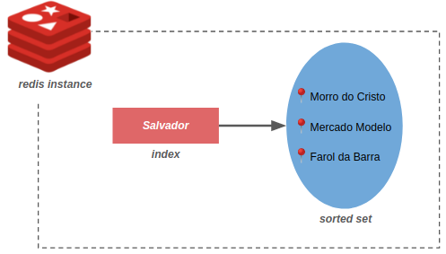

*TL;DR;* Vamos usar o Redis para armazenar dados geolocalizados.

Quando falamos em Redis invariavelmente pensamos em cache. Porém ele evoluiu e hoje é considerado um servidor que armazena diferentes estruturas de dados (hashes, sets, lists, etc).

No post de hoje vamos sair do uso comum e entender de que forma o Redis nos ajuda com quando precisamos trabalhar dados geolocalizados (para mais info, vide [documentação](https://redis.io/commands#geo)).


## Configuração do ambiente
Para replicar os comandos você vai precisar configurar um ambiente local. Estou usando o [docker](https://www.docker.com/) e o [redis-cli](https://redis.io/topics/rediscli). O CLI vem com a instalação do Redis mas eu gosto de tê-lo separado (veja este [tutorial](https://codewithhugo.com/install-just-redis-cli-on-ubuntu-debian-jessie/)). Então, basta executar os comandos abaixo:

```bash
$ docker run --name=my-redis --rm -p "6379:6379" redis:6 redis-server
$ redis-cli

127.0.0.1:6379> 
```

## Estrutura de Dados
Armazenar qualquer coisa no Redis requer a utilização de índices. De forma simples, é uma chave *string* que aponta para alguma estrutura de dados. Para lidar com dados geolocalizados o Redis utiliza a estrutura de *sorted set* (conjunto ordenado) de forma que cada ponto (lat/long) é rotulado com uma **string**. A imagem abaixo ilustra de forma simplificada essa arquitetura:



No exemplo, criamos um índice chamado *Salvador* (cidade em que sou nascido e criado 😊) que aponta para um conjunto de pontos.

**Atenção:** como o Redis utiliza a estrutura de conjuntos não é possível existir no mesmo índice dois pontos com o mesmo nome. A inserção de um ponto com o mesmo nome corresponde a uma atualização das coordenadas (operação de *upsert*).


## Mãos à obra
O Redis nos fornece uma API com os seguintes comandos: `GEOADD`,`GEODIST`, `GEOHASH`, `GEOPOS`, `GEOSEARCH`. Vamos iniciar adicionando alguns pontos ao índice `location:salvador`:

**Atenção:** Os comandos logo serão depreciados: `GEOMEMBER`, `GEORADIUS`, `GEORADIUS_RO`, `GEORADIUSBYMEMBER`, `GEORADIUSBYMEMBER_RO`. Por isso, não vamos explorá-los neste post.

```bash
127.0.0.1:6379> GEOADD location:salvador -38.5139209 -12.9730385 mercadomodelo -38.5329599 -13.0101531 faroldabarra -38.5260635 -13.0107505 morrodocristo
```

Aqui, duas observações **importantes**:

1. O redis recebe **primeiro** a longitude e depois a latitude.
    1. `CMD <set-name> <long> <lat> <member-name>`
2. Como vamos manipular os pontos dentro do índice eu optei por adotar um padrão *lowercase* nas strings e no índice. Isso evita erros na busca e também torna suficientemente legível os dados armazenados (veja a seção *Redis keys* da [documentação](https://redis.io/topics/data-types-intro)).

Uma vez inseridos os pontos, podemos brincar com a API. Vamos a alguns casos de uso.


### Obter longitude e latitude de um ou mais pontos

```bash
127.0.0.1:6379> GEOPOS location:salvador faroldabarra

1) 1) "-38.53296071290969849"
   2) "-13.01015213126540715"
2) 1) "-38.52607816457748413"
   2) "-13.0107807421129209"
```

### Calcular a distância, em metros, entre dois pontos

```bash
127.0.0.1:6379> GEODIST location:salvador faroldabarra morrodocristo

"749.1386"
```

*OBS:* Você pode passar, no final, a métrica de distância que você quer (m, km, ft, mi).

### Atualizar um ponto

```bash
127.0.0.1:6379> GEOADD location:salvador -38 -12 elevadorlacerda

127.0.0.1:6379> GEOADD location:salvador -38.5159605 -12.9740495 elevadorlacerda

127.0.0.1:6379> GEOPOS location:salvador elevadorlacerda
```

*OBS:* Como estamos trabalhando com conjuntos a atualização de um ponto se dá por inserir um ponto com a mesma string (itens repetidos não são permitidos).

### Buscar

```bash
# Pontos em um raio de 1600 metros a uma determinada longitude/latitude
127.0.0.1:6379> GEOSEARCH location:salvador FROMLONLAT -38.5175291 -13.0060716 BYRADIUS 1600 m
1) "morrodocristo"

# Pontos em um raio de 200 km de um ponto existente
127.0.0.1:6379> GEOSEARCH location:salvador FROMMEMBER faroldabarra BYRADIUS 200 km
1) "faroldabarra"
2) "morrodocristo"
3) "elevadorlacerda"
4) "mercadomodelo"

# A mesma query acima porém com as coordenadas e a distância
127.0.0.1:6379> GEOSEARCH location:salvador FROMMEMBER faroldabarra BYRADIUS 200 km WITHCOORD WITHDIST
1) 1) "faroldabarra"
   2) "0.0000"
   3) 1) "-38.53296071290969849"
      2) "-13.01015213126540715"
2) 1) "morrodocristo"
   2) "0.7491"
   3) 1) "-38.52607816457748413"
      2) "-13.0107807421129209"
3) 1) "elevadorlacerda"
   2) "4.4180"
   3) 1) "-38.51596087217330933"
      2) "-12.97405009779294005"
4) 1) "mercadomodelo"
   2) "4.6149"
   3) 1) "-38.51392239332199097"
      2) "-12.97303874405036339"

```

**Observações:**

- `GEOSEARCH` também permite restringir a quantidade de resultados por meio do parâmetro `COUNT`.
- Substitua o `BYRADIUS 200 km` por `BYBOX 200 200 km` e o Redis irá considerar um retângulo ao invés de uma área circular.
- É possível retornar os valores ordenados pela distância. Basta adicionar `ASC` ou `DESC` ao final da busca.

### Armazenar os resultados da busca

O redis permite que você faça uma busca e armazene em um índice específico. No exemplo abaixo buscamos em `location:salvador` e armazenamos em `location:results:salvador`.

```bash
127.0.0.1:6379> GEOSEARCHSTORE location:results:salvador location:salvador FROMMEMBER faroldabarra BYRADIUS 200 km

127.0.0.1:6379> KEYS *
1) "location:salvador"
2) "location:results:salvador"

127.0.0.1:6379> ZRANGE location:results:salvador 0 -1
1) "faroldabarra"
2) "morrodocristo"
3) "mercadomodelo"
```

### Geohash

Redis usa a representação em Geohash, string de 11 caracteres, para representar os pontos no conjunto de forma que ela pode ser traduzida em uma coordenada (lat / long). 

```bash
127.0.0.1:6379> GEOHASH location:salvador morrodocristo faroldabarra
1) "7jstgr6nvs0"
2) "7jstgpt4kg0"
```

Você pode verificar esse mapeamento geohash ↔ lat/long por meio do site *https://geohash.org/<coloque-aqui-o-geohash>*.

### Operações com *Sorted Set*

Como o Redis armazena essa estrutura na forma de *sorted sets* então é possível acessar esses dados usando APIs dessa estrutura de dados. Vejamos alguns exemplos (todos os comandos estão na [documentação](https://redis.io/commands#sorted-set)):

```bash
127.0.0.1:6379> ZRANGE location:salvador 0 -1
1) "faroldabarra"
2) "morrodocristo"
3) "elevadorlacerda"
4) "mercadomodelo"

127.0.0.1:6379> ZREM location:salvador elevadorlacerda
(integer) 1

127.0.0.1:6379> ZCARD location:salvador
(integer) 3

127.0.0.1:6379> ZCOUNT location:salvador -inf +inf
(integer) 3
```

## Considerações Finais

- Pense no Redis além da chave-valor. Existem outras estruturas de dados para você brincar.
- Cuidado com o nome do índice e dos pontos. Você vai precisar buscá-los de uma forma inteligente e que evite erros de digitação.
- Antes de inserir todos os pontos pense em como você vai buscar os dados. Será que faz sentido todos os pontos estarem no mesmo índice? E se você precisar fazer *sharding*?

E ai, curtiu o post?
